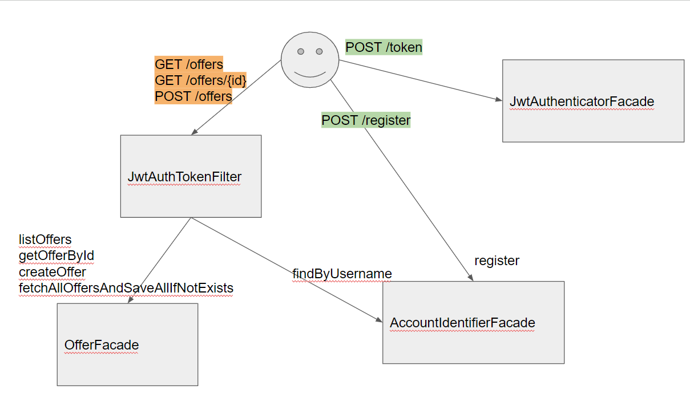

# JobOffers - Backend
The JobOffers backend is a secure platform that allows users to
to access job offers by authenticating themselves.
It also allows users to create their own job offers.
offers. It also contains a scheduler that updates
offers from an external API every 3 hours.
In addition, the application uses Redis caching for
optimised performance and faster data retrieval.

## Architecture



## Endpoints

| Endpoint           | Method | Request                                     | Response                 | Function                                  |
|--------------------|--------|---------------------------------------------|--------------------------|-------------------------------------------|
| `/register`        | `POST` | JSON BODY(username, password)               | JSON (boolean isCreated) | create new user                           |
| `/token`           | `POST` | JSON BODY(username, password)               | JSON (token, username)   | Returns user data                         |
| `/offers`          | `POST` | JSON BODY(title, company, salary, offerUrl) | JSON (offer)             | Creates new offer                         |
| `/offers/{id}`     | `GET`  | Path variable id                            | JSON (offer)             | Print selected offer                      |
| `/offers`          | `GET`  | -                                           | JSON (list of offers)    | Print all offers


## Technologies


## How to build the project on your own
1. Clone this repository
```shell
git clone https://github.com/FuuKowatty/Job-Offers.git
```
2. Go to the folder with cloned repository
3. Run docker compose
```shell
docker compose up
```
4. Run the application
